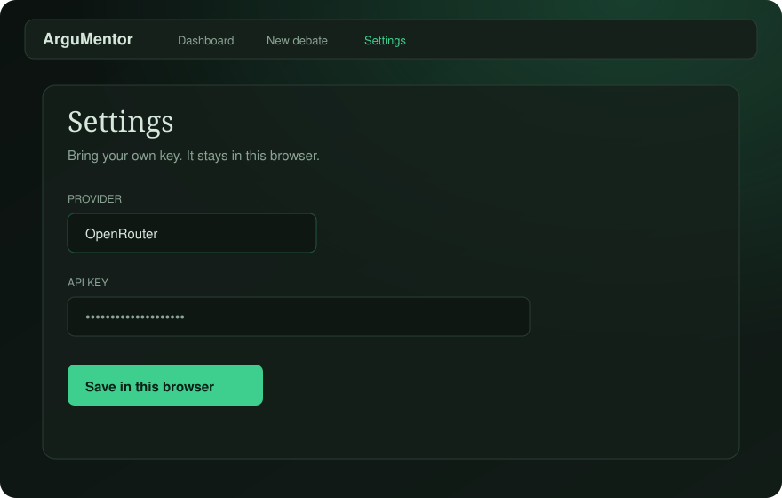
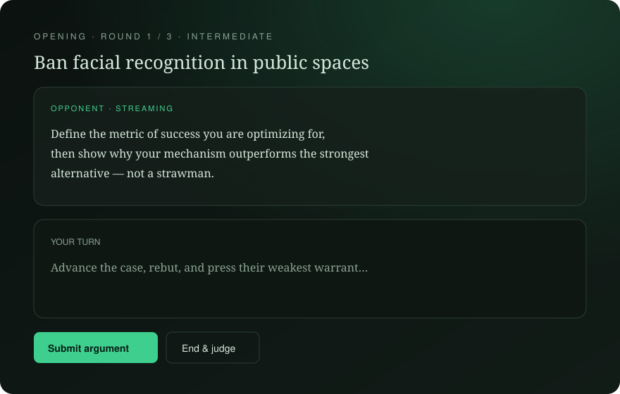

# ⚔️ ArguMentor

### Train against an elite AI debate partner.

<p align="center">
  
  
  
  
</p>

ArguMentor is an open-source **debate training platform**. Pick a topic, argue turn-by-turn with an adaptive opponent, get judged with structured feedback, and improve with coaching and research tools.

Bring your own OpenRouter, Anthropic, or OpenAI key in **Settings**. Keys stay in your browser.

> 🧠 Not a chatbot wrapper — a full practice loop:
>
> **🗣️ Debate → ⚖️ Evaluate → 📈 Learn**

<p align="center">
  
  
  
</p>

---

## 🗺️ Explore

- [✨ Features](#-features)
- [🚀 Quick start](#-quick-start)
- [🔑 Bring your own key](#-bring-your-own-key)
- [📁 Project structure](#-project-structure)
- [🧰 Stack](#-stack)
- [📜 Scripts](#-scripts)
- [🤝 Contributing](#-contributing)
- [👤 Author](#-author)
- [📄 License](#-license)

---

## ✨ Features

| | Feature | What you get |
|---|---|---|
| 🥊 | **AI Debate Opponent** | Topic, side, difficulty, personality, format & rounds — streaming rebuttals |
| ⚖️ | **Judge Scorecard** | Clarity, evidence, logic, persuasiveness + teachable mistake notes |
| 🔬 | **Turn Analysis** | Claims, evidence, assumptions & weakness hints after every turn |
| 🎓 | **Personal Coach** | Training plans and drills from your latest evaluation |
| 📚 | **Research Assistant** | Evidence briefs & viewpoint lenses before you hit the floor |
| 🧩 | **Skill Memory** | Progress across sessions |
| 🎙️ | **Optional Voice** | Push-to-talk + spoken opponent turns — toggleable in the UI |
| 🔐 | **Bring Your Own Key** | OpenRouter, Anthropic, or OpenAI — configured in Settings, never committed |

---

## 🚀 Quick start

**Requirements:** Node.js **24+** · [pnpm](https://pnpm.io) **11.22+** (Corepack recommended)

```bash
git clone https://github.com/TeslaNeuro/ArguMentor.git
cd ArguMentor

corepack enable && corepack prepare pnpm@11.22.0 --activate

pnpm install
pnpm --filter @argumentor/web dev
```

🌐 Open **[http://localhost:3000](http://localhost:3000)** → **Settings** → paste your API key → **Start a debate**.

---

## 🔑 Bring your own key

ArguMentor does not ship with a model key. Add yours in the app:

1. Open **Settings**
2. Choose **OpenRouter** (easiest — one key, many models), **Anthropic**, or **OpenAI**
3. Paste the key and pick models
4. Save — it stays in this browser only

Get an OpenRouter key at [openrouter.ai/keys](https://openrouter.ai/keys).

---

## 📁 Project structure

```text
ArguMentor/
├── 🌐 apps/web              Next.js web app
├── 🧠 packages/debate-core  Debate state machine, schemas, prompts
├── 🤖 packages/agents       Opponent · Judge · Analysis · Coach · Research
├── 🗄️ packages/db           Persistence
├── 🎨 packages/ui           Shared design tokens
└── ⚙️ packages/config       Shared TypeScript config
```

---

## 🧰 Stack

| Layer | Choice |
|---|---|
| 📦 Monorepo | Turborepo + pnpm |
| 🌐 Web | Next.js App Router · TypeScript |
| 🤖 AI | Vercel AI SDK · your key in Settings |
| 🚀 Deploy | Vercel-ready (`apps/web`) |

---

## 📜 Scripts

| Command | What it does |
|---|---|
| `pnpm --filter @argumentor/web dev` | 🟢 Run the web app |
| `pnpm test` | ✅ Run tests |
| `pnpm build` | 🏗️ Production build |

---

## 🤝 Contributing

See [CONTRIBUTING.md](CONTRIBUTING.md).

---

## 👤 Author

**Arshia Keshvari**

Built for people who want to argue better — not just louder.

---

## 📄 License

Released under the [MIT License](LICENSE) — free to use, fork, and build on.

<p align="center">
  <sub>⚔️ Argue better. Think sharper. Train with ArguMentor.</sub>
</p>
